<b>Hi there</b> 👋    
- Pursuing Honor B.S. in <ins>Mathematics</ins> and <ins>Computer Science</ins> :-)       
- Trying to delve into the application of <ins>Logic</ins> and <ins>Algebra</ins> in <ins>Programming Language Theory</ins>       
- Currently a junior at <ins>University of Wisconsin-Madison</ins>      
- Once pursuing Software Engineering at <ins>Nanjing University</ins>    

  

<b>By 2024 December I'll be learning</b>       
- Model Theory
- Abstract Algebra
- Point Set Topology
- Program Synthesis

  

